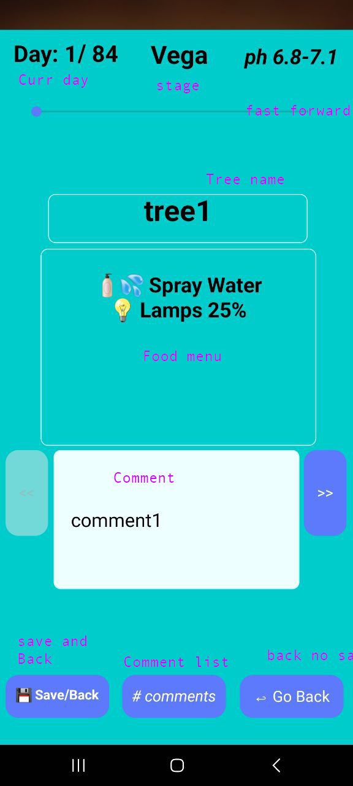
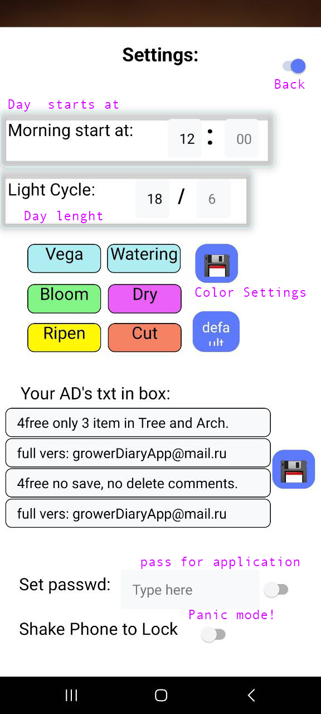
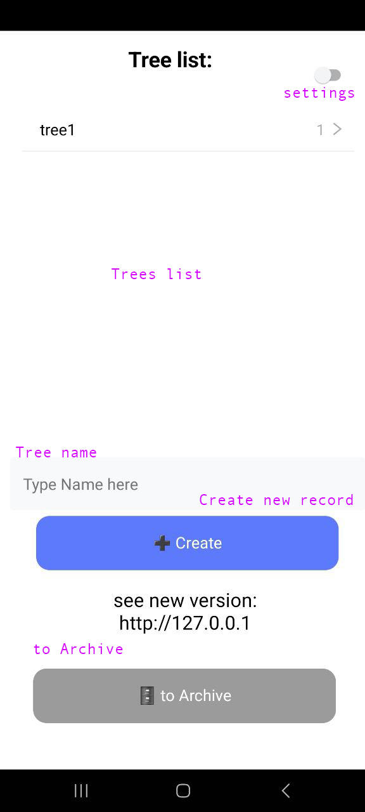
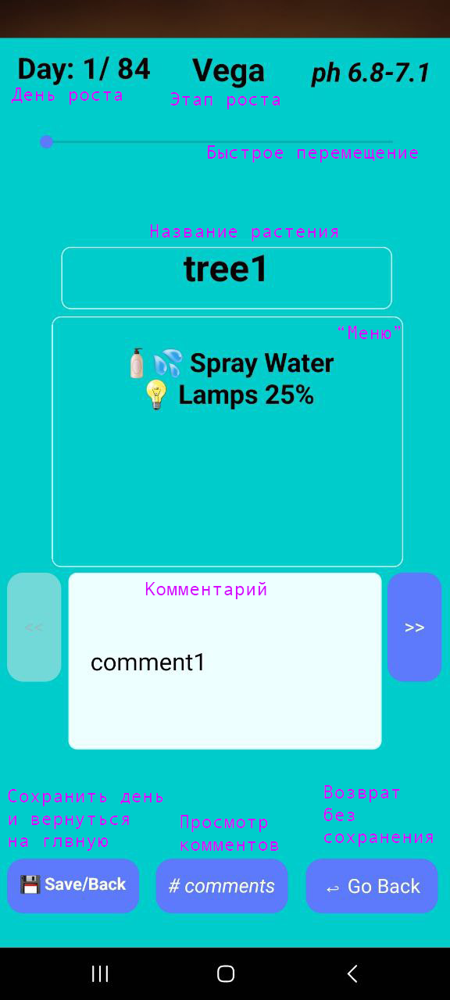
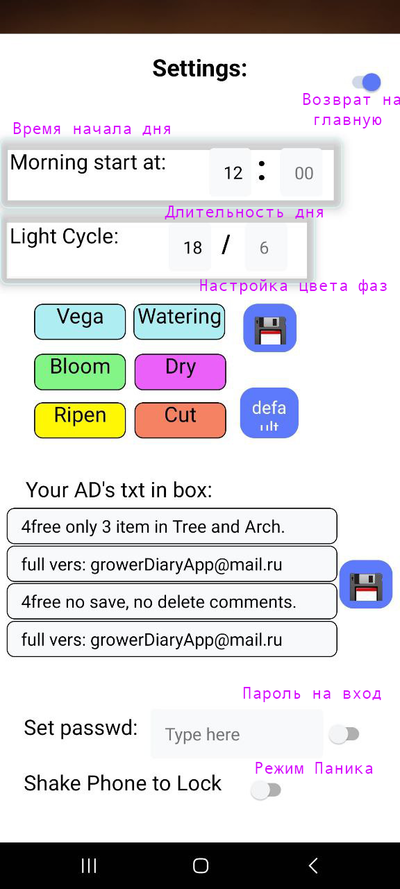
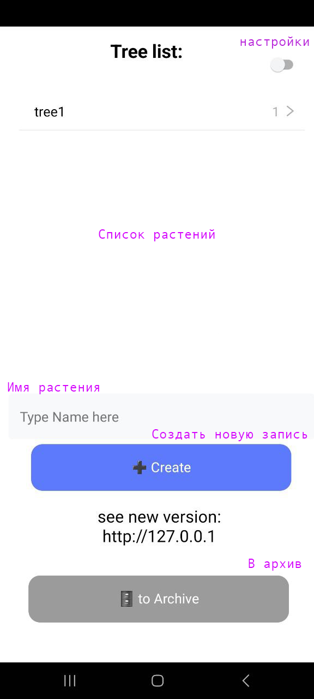

Short description: 
Grower's Diary is a comprehensive application designed for beginners and experienced gardeners who want to track the growth of their plants and increase their yield. This app gives you complete control over the growing process, making it easy to manage all aspects of plant care.

Description:

Key Features:
* Active Plant Diary: Keep a detailed diary for each active plant, tracking growth progress, making comments and viewing statistics.
* Archive: Transfer plants to the archive when they reach maturity, saving all information about them for future use.
* Adding comments: Add comments to each day of growth for active plants and to archived plants, documenting care, growing conditions and observations.
* Statistics: Learn statistics for each plant, including vegetative stage length, flowering period, and yield.
* Feeding scheme: Use the built-in feeding scheme based on the recommendations of foreign experts.
* Settings: Customize the app to suit your needs by setting the start time of the day, length of daylight hours and color indication of growth stages.

Convenience for beginners:
Grower's Diary is ideal for new gardeners, providing a clear interface, step-by-step guides and helpful tips. The application will help you confidently start growing plants and gain the necessary knowledge.

Tool for experienced gardeners:
Experienced gardeners will find Grower's Diary a valuable tool for organizing their knowledge, tracking plant progress, and collecting data to improve growing strategies.

Additional functions:
* Lock: Set a password to log into the application to protect sensitive data.
* Panic Mode: Shake your phone to lock an app and hide it, keeping you safe in unexpected situations.

Benefits of Grower's Diary:
* Improved plant growth management
* Increased yield
* Organizing cultivation knowledge
* Increased confidence in gardening
* Permanent access to plant data

Download Grower's Diary today and make growing plants easier, more efficient and more productive!

<b>First Run and Settings:</b> 
After installing the application, you need to go to the settings and set the start time of the day and duration.

The remaining settings items only work in the full version.

After the initial settings, you can proceed to creating a new plant:
select a name and create a new entry.

Click on the new entry and go to the plant screen.

In the full version you can add information about the plant: description, sizes of pots and boxes, light source.

Using arrows to the right and left, we navigate through the days of growth and add comments to the process.
You can view all comments and delete lines from the log.
For visual control, the background color will change when the next "Stage" in the plant's life is reached.
(color scheme can be changed in settings)

After completing the “Menu” for the day and adding comments, we save our activity and return to the main page.
Swiping right allows you to remove a plant from the list.
Swipe left - moves the plant to the archive.

Swipe actions are also available in the archive:
- swipe right - deletes the entry.
- swipe to the left - makes the plant active again (transfer the plant back from the archive)

In the full version of the application in Archive, you can add and edit comments,
The cycle of life does not stop when the last day of the cycle is reached.
